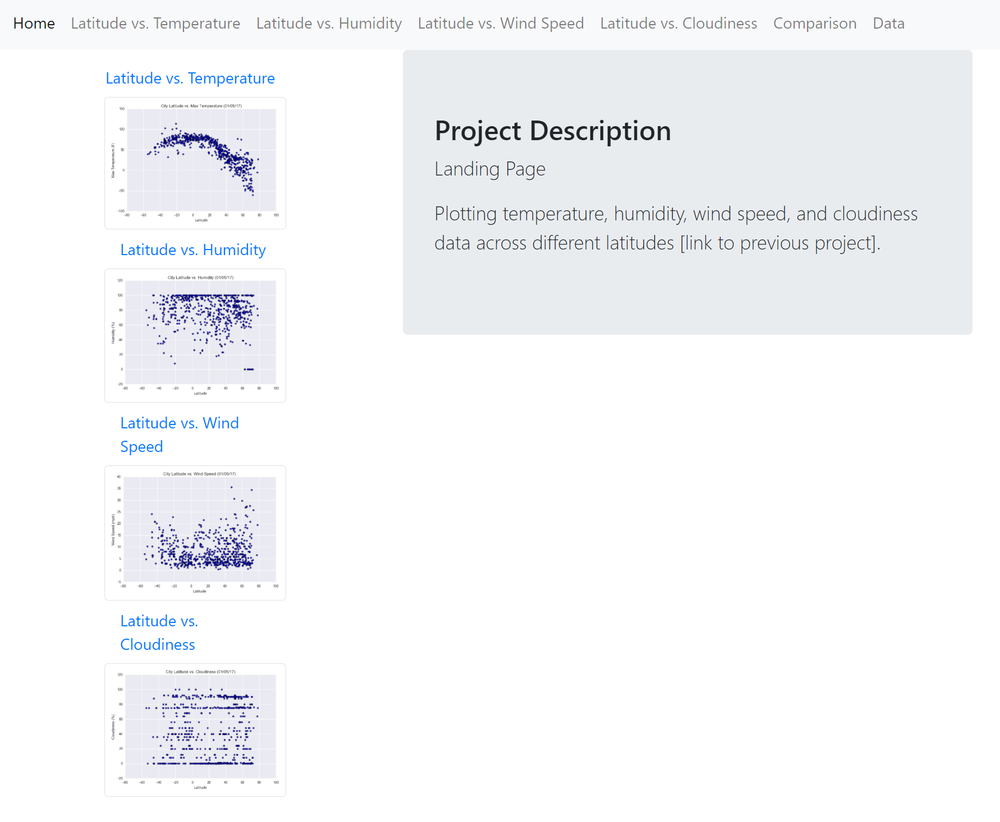

# Web Design

* Landing Page
    * project description
    * links to each visualizations page
    * sidebar linking each image to its own page
* Visualization Pages (each)
    * title
    * heading
    * visualization
    * description
* Comparisons Page
    * page with each visualization, for comparison, using a bootstrap grid from [assets](https://github.com/dianewitt/web-design/tree/main/assets)
* Data Page
    * page with responsive table containing data from [Resources](https://github.com/dianewitt/web-design/tree/main/Resources)

* Web Design

    